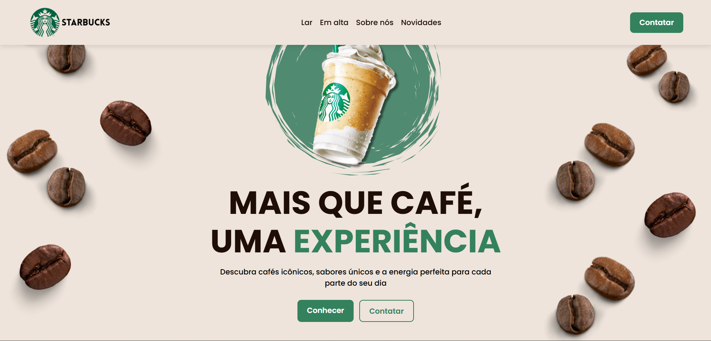

<h1 align="center"> Starbucks </h1>

Landing page inspirada no site da Starbucks, feita para interações com o usuário.

  <a href="#-tecnologias">Tecnologias</a>&nbsp;&nbsp;&nbsp;|&nbsp;&nbsp;&nbsp;
  <a href="#-projeto">Projeto</a>

 

  

## 🚀 Tecnologias

Esse projeto foi desenvolvido com as seguintes tecnologias:

- HTML e CSS
- JavaScript
- Git e Github

## 💻 Projeto

- Estrutura de layout com HTML
- Estilização com CSS
- Responsividade

---

Feito por &copy;Vitor Alves